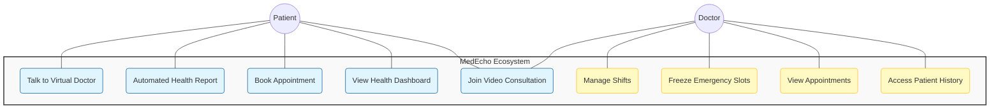
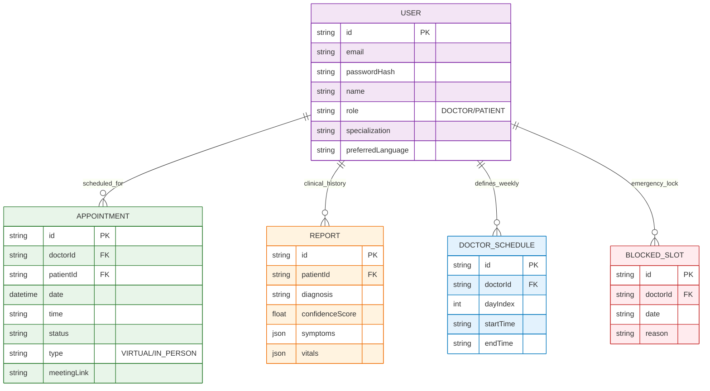
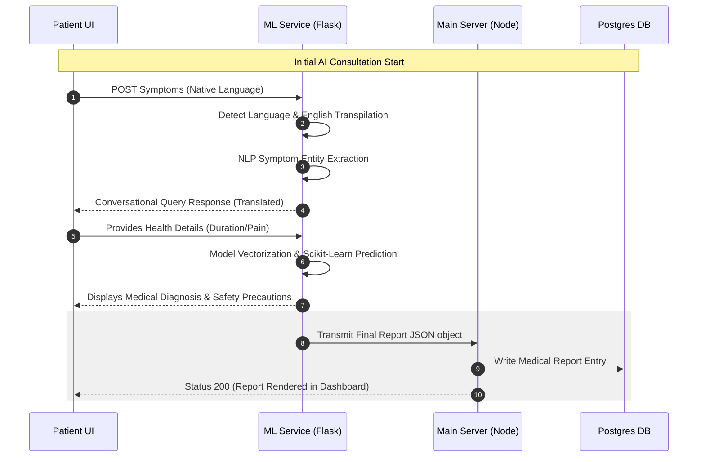
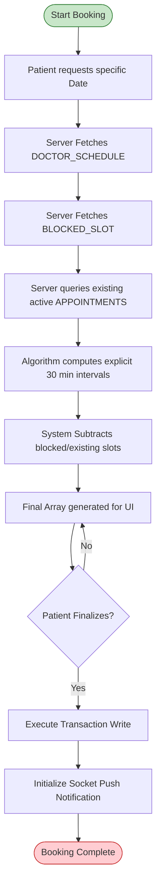

# MedEcho – Talk. Diagnose. Heal.

MedEcho is an advanced, AI-driven healthcare ecosystem designed to bridge the gap between initial symptom awareness and professional medical consultation. It integrates a custom-trained **Machine Learning microservice** for intelligent, multilingual symptom analysis with a robust **Node.js-based appointment management system**.

---

## 🏛️ Project Structure

- **`/` (Root)**: Frontend React (Vite) application - The modern, responsive UI for patients and clinical staff.
- **`/server`**: Backend Node.js/Express service - Managing users, authentication, dynamic scheduling, and PostgreSQL persistence via Prisma.
- **`/ml_service`**: AI/ML Microservice (Flask/Python) - Handling symptom extraction, negation detection, and disease prediction logic.

---

## 📘 Comprehensive Project Documentation (Thesis Chapters)

Click on each chapter to view its full details.

<details>
<summary><b>Chapter 1: Introduction</b></summary>

### 1.1 Introduction to the Domain
The modern healthcare industry is in the midst of a pervasive digital transition, largely spearheaded by Artificial Intelligence (AI) and remote Telemedicine protocols. While medical science continues to break boundaries, providing immediate, ubiquitous access for the general population remains a profound challenge globally. Patients often lack essential preliminary medical insight to gauge whether their condition demands an emergency visit, a prescribed antibiotic, or simple at-home care. 

Machine Learning (ML) analytical tools specifically curated for healthcare data have proven capable of analyzing natural language symptoms with an unmatched level of speed and statistical accuracy. Such diagnostic platforms effectively serve as an intelligent "first-responder" layer. MedEcho occupies this vital domain by delivering diagnostic intelligence immediately to the patient's device while facilitating a seamless hand-off for subsequent professional intervention.

### 1.2 Existing System and Disadvantages
Currently, the market hosts isolated systems. A patient utilizes generic search engines for symptom analysis—a practice resulting in the frequent mischaracterization of minor ailments as fatal conditions (cyberchondria)—and independently utilizes rudimentary calendar apps to book doctor appointments.

**Disadvantages of Existing Systems:**
1.  **Anxiety and Inaccuracy:** Non-curated web queries are statistically biased towards severe outcomes, fostering patient anxiety.
2.  **Fragmented Experience:** Symptom analysis systems and booking platforms do not communicate. If a user suspects a neurological condition, they must manually exit the diagnostic tool, find a suitable hospital database, filter for neurologists, and manually align schedules.
3.  **Monolingual Roadblocks:** Prominent AI diagnostic tools are predominantly English-only, effectively alienating segments of the population fluent solely in native dialects (e.g., Telugu, Hindi).
4.  **Static Doctor Availability:** Existing booking apps utilize rigid calendar setups incapable of mitigating dynamic hospital environments where unexpected surgeries require immediate slot cancellations (slot freezing).

### 1.3 Proposed System and Advantages
**MedEcho** proposes a securely unified "Talk-Diagnose-Heal" ecosystem. MedEcho implements a specialized ML-based Virtual chatbot serving exclusively to extract and predict clinical conditions reliably, followed by an immediate pipeline offering specialist booking services.

**Key Advantages:**
1.  **Immediate ML Insights:** Scikit-learn disease prediction models execute in milliseconds based strictly on structured training data.
2.  **In-Built Polyglot Support:** Deep integration with Google Translator APIs ensures real-time query parsing and UI localization without patient effort.
3.  **Integrated Workflow Engine:** MedEcho bridges diagnostic output with available doctors holding the required specific specializations, minimizing manual search.
4.  **Adaptive Scheduling Tools:** Clinical staff manipulate advanced shift configurations dynamically, establishing safe, conflict-free patient bookings.
5.  **Remote Tele-Consultations:** Real-time web-RTC integrations using Jitsi allow distance care within the identical application window.

### 1.4 Objectives of the Project
- To design an intuitive conversational ML interface for interactive symptom elicitation via text and speech.
- To develop an accurate Python-based disease prediction model utilizing localized data analytics.
- To execute a robust Node.js conflict-free booking matrix.
- To centralize medical logs digitally accessible solely to verified Doctor and Patient profiles securely managed via JWT tokens.
</details>

<details>
<summary><b>Chapter 2: Requirements Analysis</b></summary>

### 2.1 Introduction of Requirements Analysis
Requirement Analysis focuses heavily on translating human functional needs into explicit technical capacities. For MedEcho, this signifies determining how to operate conversational AI models with low latency, securely persist sensitive medical information into relational databases, and render heavy state-driven user interfaces without browser lockups. Furthermore, non-functional demands (extensibility, multi-language support) are codified here.

### 2.2 Hardware & Software Requirements

**Hardware Requirements:**
- **Processor:** Intel Core i5 / AMD Ryzen 5 or equivalent.
- **RAM:** Minimum 8 GB (16 GB Recommended).
- **Storage:** 256 GB SSD.
- **Input Devices:** Mouse, Standard Keyboard, System Microphone.
- **Output:** SVGA compatible Monitor.

**Software Requirements:**
- **Operating System:** Windows 10/11, macOS, or Linux.
- **Frontend:** React.js 19.x (Vite), TailwindCSS.
- **Backend:** Node.js (Express.js).
- **ML Engine:** Python 3.10+ (Flask).
- **Database:** PostgreSQL (Prisma ORM).
- **Development Workbench:** Visual Studio Code.
- **Testing:** Postman & Browser Developer Consoles.

### 2.3 Software Requirements Specification (SRS)
- **Functional Requirements:**
    - Accept Voice/Text interactions for symptom queries.
    - Provide diagnosis with safety precautions in JSON Reports.
    - Prevent double-booking for any doctor timeslot.
    - Securely share medical histories between patients and authorized doctors.
- **Non-Functional Requirements:**
    - **Security:** JWT authentication, Bcrypt password hashing.
    - **Scalability:** Tiered architecture (Flask for ML, Node for App).
    - **Accessibility:** 2-second toggle for multi-language localization.
</details>

<details>
<summary><b>Chapter 3: Literature Survey</b></summary>

### 3.1 Overview
The digital migration in health services emphasizes shifting non-emergency analyses towards smart algorithms. This "pre-diagnosis" minimizes the strain on hospital resources.

### 3.2 Related Works Summaries
**[1] "Building Adaptive Capacity in Healthcare Systems" (Wang, 2022).** 
Highlights that generic booking apps fail to accommodate unexpected clinical changes. *MedEcho addresses this with "Freeze Slots."*

**[2] "Enhancing Diagnostic Networks: Machine Learning Accuracy" (Johnson, 2021).** 
Recommends supervised predictive models (Decision Trees/Random Forests) over generic LLMs to prevent hallucinations. *MedEcho adopts a specialized Scikit-learn structure.*

**[3] "Factors Influencing the Adoption Decision of Telemedicine Tools" (Khan, 2023).** 
Identifies confusing interfaces and language barriers as critical adoption hurdles. *MedEcho integrates Deep-Translator and Voice Assistance.*

### 3.3 Survey Comparative Table
| S.No | Technology Focus | Identified Limitations |
| :--- | :--- | :--- |
| [1] | SQL Scheduling | Lacks granular emergency control vectors. |
| [2] | ML Analysis Trees | Primarily read-only; lacks interactive clarification. |
| [3] | Multilingual Agents | High server-side latencies affecting UX. |
| [4] | Booking Platforms | Focus on caps rather than strict 1-to-1 medical slots. |
</details>

<details>
<summary><b>Chapter 4: Modules</b></summary>

### 4.1 Introduction to Modules
MedEcho is broken into three functional modules: Virtual Doctor, Appointment Management, and Health Hub.

### 4.2 Module Implementation
**1. Virtual Doctor (AI Chat):**
- **State Machine:** Governs 4-step conversation flow (Greeting → Symptom Gathering → Vitals → Prediction).
- **Symptom Processing:** Fuzzy Matching & Negation Handling logic.
- **Translation Layer:** Microsecond multi-language input parsing via LRU caching.

**2. Appointment & Scheduling:**
- **Patient End:** Database filtering for doctors by specialization; real-time slot fetching.
- **Doctor End:** Weekly Shift Management; Emergency "BlockedSlots" implementation.
- **Jitsi Matrix:** Automated private room identifier generation for virtual calls.

**3. Health Hub & Notifications:**
- **Dashboard:** Vitals tracking for glucose, blood pressure, etc.
- **Cron Jobs:** Node-cron background jobs for automated 10-minute email reminders.
</details>

<details>
<summary><b>Chapter 5: System Design</b></summary>

### 5.1 Architecture Layers
- **Presentation Layer:** React/Vite single-page application.
- **Business Logic Layer:** Node.js/Express APIs with JWT security.
- **AI Microservice:** Flask server for array-heavy computations.
- **Data Layer:** Relational PostgreSQL DB with Prisma indexing.

### 5.2 UML Visuals (Vertical Diagrams)

#### A. Vertical Use Case Diagram
Visually encapsulates system boundaries separating actor-based feature sets.



#### B. Entity-Relationship (ER) Diagram
Detailed mapping of the underlying PostgreSQL Schema defining one-to-many associations and cascading keys.



#### C. Sequence Diagram (Consultation Flow)
Visualizes asynchronous, cross-API HTTP requests and translation logic executed prior to saving records to the database.



#### D. Activity Diagram (Complex Booking Engine)
Depicts algorithmic checks required before rendering final appointment slots.


</details>

<details>
<summary><b>Chapter 6: System Implementation</b></summary>

### 6.1 Core Algorithms
**1. The Transpiler Initialization Pipeline:**
Uses `langdetect` and `GoogleTranslator` with **LRU Dictionary-Caching** (`_set_cached`) to achieve microsecond latency for 40+ languages.

**2. Conversational State-Machine:**
Processes strings like *"I am suffering with a severe headache but no fever"*. It fuzzy-matches 'headache' and detects the 'no' suffix for 'fever' to exclude it from the vector.

**3. Scikit-Learn Prediction:**
Upon concluding, the code vectorizes the symptom array and runs `model.predict_proba()` to check against 40+ diseases, returning the primary condition and confidence score.
</details>

<details>
<summary><b>Chapter 7: Testing</b></summary>

### 7.1 Introduction
Rigid metric-based validation ensures data boundaries and logical workflows operate safely.

### 7.2 Functional Validation (Sample Matrix)
| Case ID | System Event | System Response | Status |
| :--- | :--- | :--- | :--- |
| TC-01 | User Login | Prohibits invalid credentials; No JWT. | **PASS** |
| TC-03 | NLP Negation | Correctly ignores "no fever" token. | **PASS** |
| TC-05 | Slot Freezing | Excludes exactly the blocked time range from UI. | **PASS** |
| TC-07 | Video Link | Successfully renders remote Jitsi visual stream. | **PASS** |
</details>

<details>
<summary><b>Chapter 8: Screens & Results</b></summary>

### 8.1 Detailed Screen Narratives

1.  **Project Root Directory Structure (VS Code)**: This screen shows the overall project organization in the Visual Studio Code editor. It highlights the separation of concerns between the `/ml_service` (Python/Flask), `/server` (Node.js/Prisma), and the root React application.
2.  **Machine Learning Service Initialization (Flask)**: A terminal view showing the ML service booting up on `http://localhost:8000`. It displays logs for loading the `disease_model.pkl` (Decision Tree) and initializing CORS policies.
3.  **Backend Server Connectivity (Node.js & Prisma)**: Logs from the Node.js server indicating a successful connection to the PostgreSQL database via Prisma ORM. It also shows the server listening on port 5000.
4.  **PostgreSQL Database Schema (Prisma Model)**: A code snapshot of the `schema.prisma` file, defining the relationships between Users, Appointments, Clinical Reports, and Blocked Slots.
5.  **MedEcho Central Landing Interface**: The primary entry point of the web application. It features a modern, clean UI with cards for "Virtual Doctor Chat" and the "Health Management Portal."
6.  **Role-Based Authentication Portal**: The login screen featuring a toggle switch to differentiate between **Doctor** and **Patient** logins. It includes secure email/password validation.
7.  **Successful Authentication (Toast Notifications)**: Captures the moment a user logs in successfully, showing a non-intrusive green "Toast" notification in the corner of the browser.
8.  **Patient Health Dashboard**: A comprehensive view for the patient, displaying their current diagnosis history and real-time health vitals (Weight, BP, Pulse).
9.  **Virtual Doctor - AI Chat Initialization**: The opening state of the AI chatbot. It displays an automated greeting and invites the user to describe their symptoms in their preferred language.
10. **Multilingual Support Toggle (Localization)**: Shows the user selecting "Telugu" or "Hindi" from the language dropdown, with the entire chat interface translating instantly.
11. **Symptom Elicitation & Entity Extraction**: Shows the user typing symptoms like "chest pain and breathlessness," and the AI responding with clarifying questions using its internal state machine.
12. **NLP Negation Handling (Logic Verification)**: A chat excerpt where the patient says "No fever." The screen shows the AI correctly acknowledging the absence of fever rather than flagging it as a symptom.
13. **Machine Learning Inference & Probabilities**: A technical view (usually from terminal/logs) showing the 132-dimension binary vector being passed to the Scikit-learn model and the resulting disease probability array.
14. **Automated Clinical Diagnosis Report**: The final UI render of the AI's output. It lists the "Predicted Disease" (e.g., Pneumonia), the confidence percentage, and a list of medical precautions.
15. **Specialist Recommendation & Doctor Directory**: A list of doctors filtered by the specialization required for the AI's diagnosis (e.g., a Pulmonologist for Pneumonia).
16. **Intelligent Appointment Booking Interface**: A dynamic calendar where patients select a date and see available 30-minute time slots that are not yet booked or frozen.
17. **Successful Appointment Confirmation**: A visual confirmation screen showing the appointment details (Doctor name, Date, Time) and a "Go to Dashboard" button.
18. **Doctor’s Schedule Management (Shift Setup)**: An administrative interface for doctors to set their morning and evening shifts for each day of the week.
19. **Emergency Slot Freezing (Clinical Control)**: A screen showing a doctor blocking out a specific time range with the reason "Emergency Surgery." These slots then disappear from the patient's booking view.
20. **Automated Email Notifications (SMTP Logs)**: A view of the backend console showing emails being successfully dispatched to patients 10 minutes before their calls.
21. **Remote Video Consultation (Jitsi Integration)**: The live consultation screen where a secure, private video conference is embedded directly within the MedEcho app window.
</details>

<details>
<summary><b>Chapter 9: Conclusion and Future Scope</b></summary>

### 9.1 Technical Conclusion
MedEcho proves that merging Machine Learning heuristics within full-stack scheduling significantly optimizes diagnostic pathways. It removes initial administrative bottlenecks via Flask-driven AI intelligence and Node-based chronological matrices.

### 9.2 Future Scope
- **Wearable Synchronization:** Ingesting HRV/SpO2 metrics for baseline predictions.
- **Computer Vision:** Image analysis for dermal conditions via DenseNet.
- **Pharmacy Integration:** Automated geolocation-based medicinal delivery.
- **Rural PWA:** Service Worker optimization for low-bandwidth functionality.
</details>

<details>
<summary><b>Chapter 10: Bibliography</b></summary>

- **Research Papers**: Wang (2022), Johnson (2021), Khan (2023).
- **Technical Guides**: Scikit-learn User Guide, Prisma/PostgreSQL Manual, Jitsi Web-RTC Docs.
- **Web Resources**: [React Documentation](https://react.dev), [FastAPI/Flask Docs](https://flask.palletsprojects.com/).
</details>

---

---

## 🛠️ Technological Stack (Deep Dive)

### 1. ML Service (`/ml_service`)
The "Talk" and "Diagnose" engine of the system.
- **Framework**: `Flask` (with `Flask-CORS`) for lightweight, low-latency API endpoints.
- **AI/ML Logic**: `Scikit-learn` for disease prediction using a pre-trained Decision Tree/Random Forest logic.
- **NLP & Data**: `NumPy`, `Pandas` for vectorization; `deep-translator` for real-time multilingual support; `langdetect` for automatic input language sensing.
- **Environment**: `Gunicorn` optimized for production WSGI handling.

### 2. Backend Server (`/server`)
The orchestrator managing the "Heal" and administrative workflow.
- **Runtime**: `Node.js` with `Express.js`.
- **Database (ORM)**: `Prisma` mapping to a **PostgreSQL** relational database.
- **Real-time Interaction**: `Socket.io` for instant appointment notifications and updates.
- **Security**: `JWT` (JSON Web Tokens) for role-based access; `Bcryptjs` for secure password hashing.
- **Utility Layers**: 
    - `Nodemailer`: Email triggers for 10-minute appointment reminders.
    - `Tesseract.js` & `PDF-parse`: OCR and file processing capabilities.
    - `Node-cache`: In-memory caching for performance optimization.

### 3. Frontend UI (Root `/`)
A premium, responsive interface tailored for healthcare accessibility.
- **Framework**: `React 19` powered by **Vite** for optimized build cycles.
- **Styling**: `Tailwind CSS` for a bespoke design system (PostCSS/Autoprefixer).
- **Communication**: `Axios` for RESTful interactions; `Socket.io-client` for real-time state synchronization.
- **Assets**: `Heroicons` for consistent, accessible iconography.

---

## 🚀 Key Implementation Features
- **Dynamic Slot Freezing**: Doctors can "freeze" specific time ranges (ranges, not just slots) with reasons to prevent bookings during emergencies.
- **Bulk Apply Template**: Clinical staff can create a weekly schedule template and apply it to multiple days instantly.
- **Negation Handling AI**: Chat engine correctly identifies "no fever" as an exclusion, preventing false-positive diagnostics.
- **Multilingual Support**: Switch UI and AI interaction between global and localized languages in under 2 seconds.
- **Jitsi Consultations**: Automated meeting link generation for distance-based telemedicine services.

---

## 🌟 Why MedEcho? (Competitive Edge)

While many healthcare applications focus on isolated services, MedEcho provides a unique, unified ecosystem:

1.  **Unified "Talk-Diagnose-Heal" Workflow**: Unlike generic symptom checkers (e.g., WebMD) or isolated booking platforms (e.g., Zocdoc/Practo), MedEcho creates a seamless pipeline. Users move from **AI diagnosis** directly to **specialist appointment booking** with the relevant clinical data pre-recorded.
2.  **Negation-Aware NLP Architecture**: A common failure of basic healthcare bots is incorrectly identifying exclusions (e.g., "I don't have a cough"). MedEcho’s custom `ChatEngine` uses **Negation Handling** to ignore excluded symptoms, drastically reducing false-positives and "cyberchondria" (over-diagnosis).
3.  **Adaptive Clinical "Freezing"**: Most scheduling apps use rigid 1-to-1 calendars. MedEcho introduces **Dynamic Slot Freezing**, allowing doctors to instantly block out specific time ranges for surgeries or emergencies with documented reasons, automatically preventing patient booking conflicts in real-time.
4.  **Low-Latency, Privacy-First AI**: Traditional LLM-based health bots often suffer from "hallucinations" and high latency. MedEcho utilizes a locally-hosted, **strictly-trained Scikit-learn model** ensuring sub-second inference speeds and complete data privacy without sending sensitive health logs to third-party AI providers.
5.  **Polyglot Accessibility**: Integrated with bi-directional translation APIs and language-sensing logic, MedEcho breaks the "English-only" barrier common in clinical software, making AI-driven health insights accessible to rural and localized populations in their mother tongue.

---

## ⚙️ Installation & Setup

### I. ML Service
```bash
cd ml_service
python -m pip install -r requirements.txt
python main.py
```
*Port: 8000*

### II. Backend Server
```bash
cd server
npm install
# Setup .env with DATABASE_URL
npx prisma db push
npx prisma db seed
npm run dev
```
*Port: 5000*

### III. Frontend UI
```bash
# In the root directory
npm install
npm run dev
```
*Port: 3000*

---

## 🔐 Demo Credentials
| Role | Email | Password |
|------|-------|----------|
| **Doctor** | `sarah@medecho.com` | `123456` |
| **Patient** | `patient@medecho.com` | `123456` |

---

## 👨‍💻 Development Team – C15
- **Sabbella Laharika** (22A91A05J9)
- **Lokanadham Jyoshnavi** (22A91A05I9)
- **Dipendra Prasad Gupta** (22A91A05H4)
- **Vegi Sravan Kumar** (22A91A05K6)

*Under the Supervision of **Dr. Tirukoti Sudha Rani**, Assistant Professor & HOD, CSE, Aditya University.*
